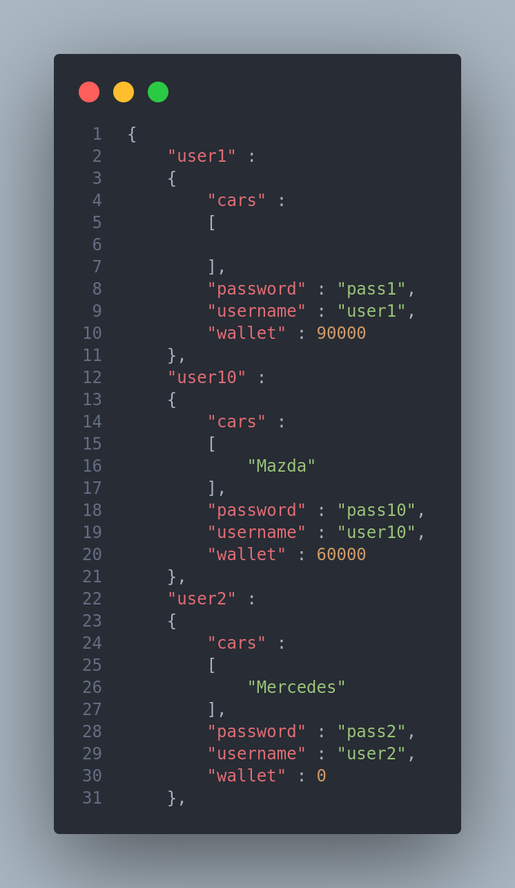
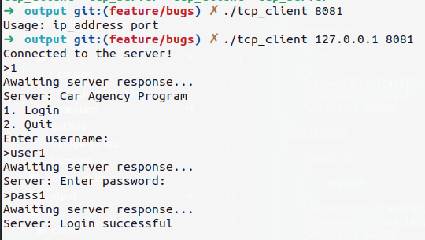
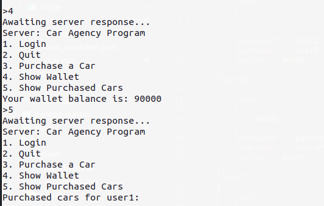
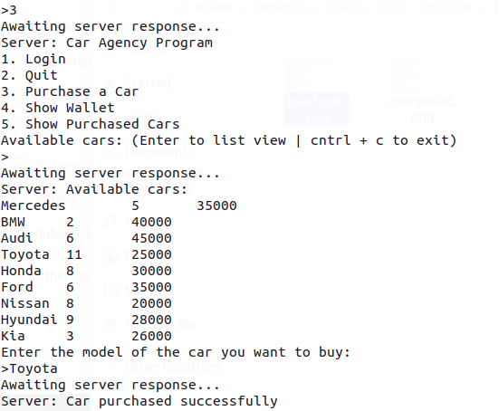
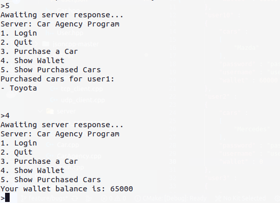
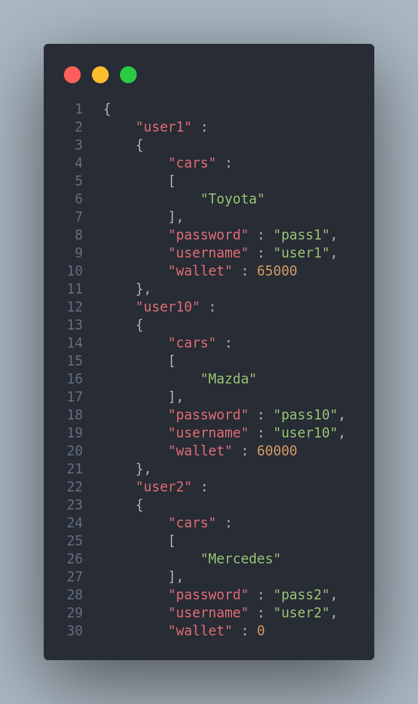

# CarAgencyStore

A car agency program to allow users to buy cars and keep track of the purchased cars and users.

### Requirements

- jsoncpp library
- C++ 17 or higher
- CMake

### How to Build

1. Clone the repository

`git clone https://github.com/pooyaaf/CarAgentStore.git`

2. Navigate to the repository directory

3. Run CMake

`cmake .`

4. Build the project

`make`

5. Navigate to the output folder

6. Run the program

There are 4 files, in the output folder. First run server files using specified PORT. Then run Client files using IP_SERVER + PORT

### Files

- Car.h: header file for the Car class
- Car.cpp: implementation file for the Car class
- User.h: header file for the User class
- User.cpp: implementation file for the User class
- CarAgency.h: header file for the CarAgency class
- CarAgency.cpp: implementation file for the CarAgency class
- CMakeLists.txt: CMake file for building the project
- main.cpp: main program that creates an instance of the CarAgency class and allows users to login, buy a car, and quit the program.
- car.json: JSON file containing information about the available cars
- user.json: JSON file containing information about the users and their purchased cars.

### Program Environment

- User JSON status before buying a car:

- User login:
  

- User wallet before buying a car:
  

- User purchase:
  

- User wallet after buying a car:
  

- User JSON status after buying a car:
  
